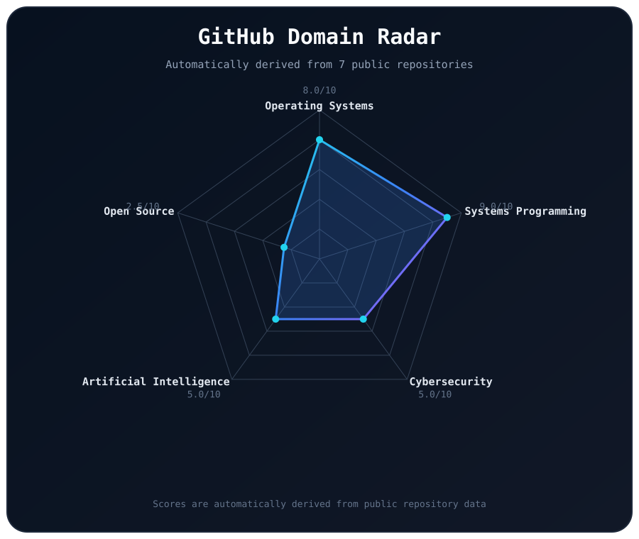
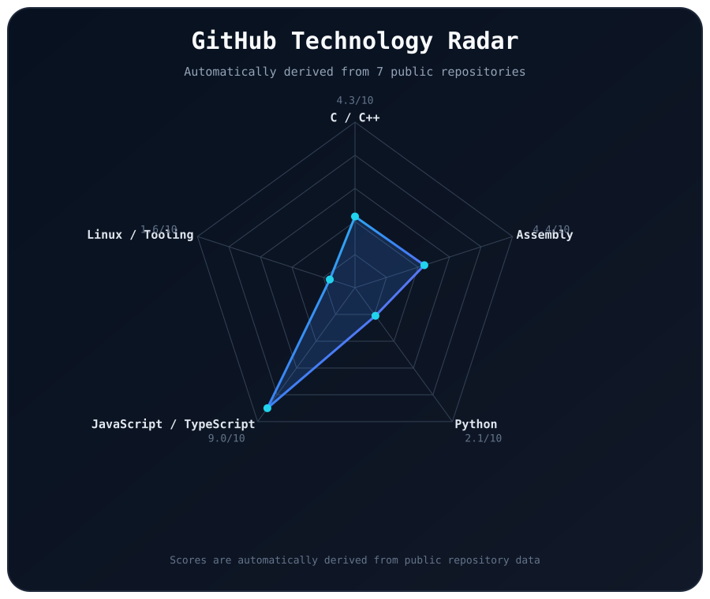
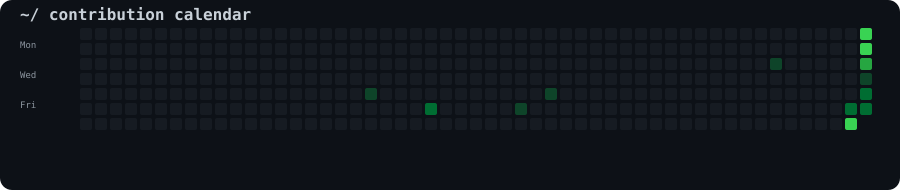

<div align="center">


# Aakansha Sharma


<br>

[](https://github.com/Aakansha-Sharma1)
[](https://www.linkedin.com/in/aakanshas/)
[](mailto:aakansha.s0506@gmail.com)

</div>
---

```text
~/ whoami

Aakansha Sharma
IT Engineering Student

Interested in:
→ Operating Systems
→ Systems Programming
→ Cybersecurity
→ Artificial Intelligence
→ Open Source

Currently building:
→ InitraOS
```

---

## 🚧 Currently Building

### InitraOS

A from-scratch operating system built step-by-step to understand how an operating system works internally.

**Current focus:** Process & Task Management

**Stack:** `C` `x86 Assembly` `NASM` `QEMU` `Make` `GitHub Actions`

[View InitraOS →](https://github.com/Aakansha-Sharma1/InitraOS)

---

## 🧰 Toolbox

### Languages


### Systems & Development


### Low-Level & OS


---

<div align="center">

## `~/` skill radar

<table>
<tr>
<td width="50%" align="center">



</td>
<td width="50%" align="center">



</td>
</tr>
</table>

<sub>Scores are automatically derived from my public GitHub repositories.</sub>

</div>

---

<div align="center">

## `~/` contribution calendar



</div>

---

<div align="center">

## `~/` contribution snake


</div>
